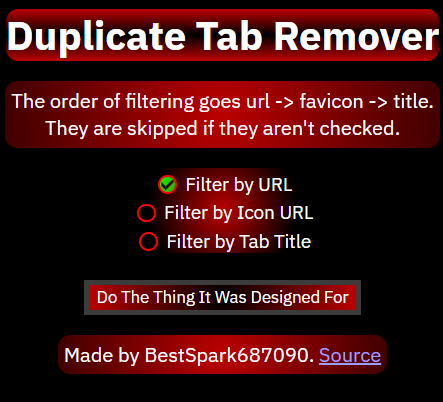

# Duplicate Tab Remover Extension

Does as it says.

## features!1!
* filter tabs by URL,
* or filter tabs by icon URL,
* maybe even filter tabs by title.
* why not all three, that's possible!
* 7 different combinations of filtering!
* an alert when none are selected
* only filters tabs in the window you're in to keep your other tabs nice and safe!

## how to use
* select your filter options
* press the button that says "Do The Thing It Was Designed For" (weird name, but whatever :P)
* the tabs will get filtered according to your options!
